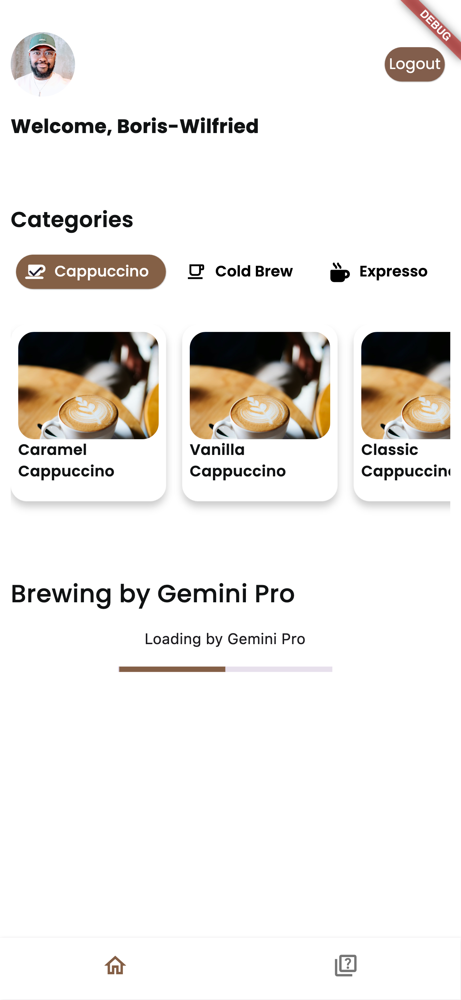
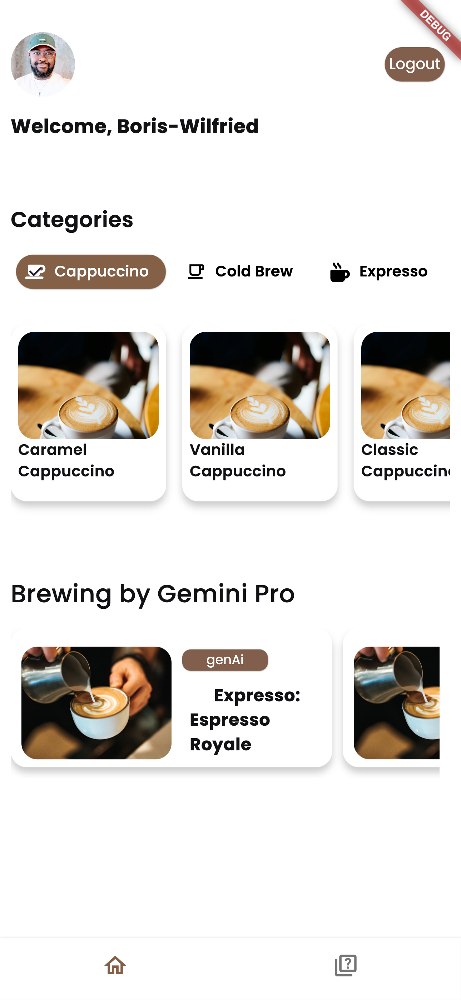

# Aroma Journey App powered by Gemini Pro and Google's Generative AI SDK for Dart

**Aroma Journey** is an immersive and enlightening Flutter application that invites users to embark on a captivating exploration of the world of coffee. Leveraging the latest in AI technology with Gemini Pro and Google's Generative AI SDK for Dart, Aroma Journey transforms coffee appreciation into an engaging and educational adventure.


<table style="width:100%">
  <tr>
    <th>License</th>
    <th>CI</th>
    <th>Flutter</th>
  </tr>
  <tr>
    <td>
        
    </td>
    <td>
        <a href="https://codemagic.io/apps/64fb84da8ddef7a6caff3441/64fb84da8ddef7a6caff3440/latest_build" target="_blank">
            
        </a>
    </td>
    <td>
        
    </td>
  </tr>
</table>


## Table of Contents
- [Screenshots](#screenshots)
- [Key Features](#key-features)
- [To-Do List](#to-do-list)
- [Technologies Used](#technologies-used)
- [Installation and Setup](#installation-and-setup)
- [Contributing](#contributing)
- [License](#license)
- [Acknowledgments](#acknowledgments)

## Screenshots
<div align="center">
  
  
   
</div>
<div align="center">
  
  
  
</div>

## Key Features

- **Coffee Categories Exploration:** Dive into an array of coffee categories such as Espresso, Cold Brew, and Cappuccino, each revealing a curated collection of unique coffee varieties with their own origin stories and cultural significance.

- **Coffee Details:** Delve into the stories behind each coffee variety, from the bold richness of Espresso to the nuanced notes of Cold Brew, and discover what makes each coffee unique.

- **AI-Powered Insights:** Utilize Gemini Pro's advanced AI capabilities to generate brewing tips, flavor profiles, and health considerations tailored to each coffee variety.

- **Interactive Quizzes:** Challenge your coffee knowledge with quizzes on coffee history, preparation techniques, and flavor identification, designed to be both educational and entertaining.

## To-Do List
Here is a list of upcoming features and enhancements that I am planning for the "Aroma Journey" app:

- [ ] **Add Coffee to Favorites:** Provide users with the ability to mark specific coffee varieties as their favorites, enhancing their personalized experience.

- [ ] **Generate Quizzes Based on Favorites:** Implement a feature that generates quizzes tailored to the user's favorite coffee choices, making the learning experience more engaging and relevant.

- [x] **AI-Generated Coffee Variants:** Utilize generative AI to create unique and imaginative coffee variants, adding an element of creativity and surprise to the app's coffee exploration.

- [ ] **ImageGen Integration:** Incorporate Google Cloud ImageGen technology to dynamically generate and display coffee images within the app, enhancing the visual appeal and immersive experience for users.

- [ ] **User-Prompted Questions:** Introduce a user-input feature that allows users to prompt the app to generate specific questions or information about coffee, promoting interactivity and customization.

## Technologies Used

- **[Flutter](https://flutter.dev/):** A framework for building natively compiled applications for mobile, web, and desktop from a single codebase. The project has been updated and tested with Flutter 3.19, ensuring compatibility with the latest features and improvements.

- **[Firebase Auth](https://firebase.google.com/):** Used for user authentication and management.

- **[Google Generative AI SDK for Dart](https://pub.dev/packages/google_generative_ai):** Integrating cutting-edge AI capabilities powered by Gemini Pro for generating engaging content and quizzes.

- **[Google Ai Studio](https://ai.google.dev/tutorials/ai-studio_quickstart):** Utilized for data validation and generation, enhancing the user experience by providing accurate and relevant content.

## AI Prompt Engineering with Google AI Studio

The Aroma Journey app leverages advanced prompt engineering techniques to generate engaging and informative content about coffee. Below are screenshots from Google AI Studio, showcasing the libraries and configurations used to craft the AI-powered insights within the app.

<div align="center">
  
  
   
  
</div>


## Installation and Setup
1. Clone this repository to your local machine.

    ```
    git clone https://github.com/yourusername/aroma-journey-app.git
    ```

2. Install the required dependencies using Flutter.

    ```
    flutter pub get
    ```

## Contributing

Contributions are welcome! If you'd like to contribute to "Aroma Journey," please follow these steps:

1. Fork this repository.

2. Create a new branch for your feature/bugfix.

3. Make your changes and test thoroughly.

4. Submit a pull request to the main branch of this repository.

5. Your contribution will be reviewed and merged if approved.

<!-- License -->
## License
This project is licensed under the [License Name] - see the [LICENSE.md](LICENSE.md) file for details.
